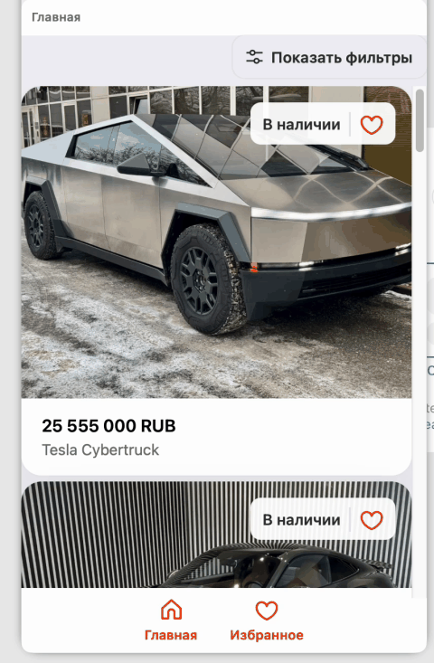

# Wheelhouse Client

Front-end for the **Wheelhouse** Telegram Mini App – a slick, cache-first car catalogue built with Next JS 15 & the Telegram Web Apps SDK.

> ⏱️ **Delivered in 30 days** together with the API and admin tools.

---

## ✨ Highlights

* **Instant feel** – SSR + smart client-side caching make scroll & search fly, even on mobile data.
* **Seamless Telegram UX** – adapts to Web Apps colour themes, viewport resizing and back-button expectations.
* **S3-optimised images** – all car shots are resized & served through AWS S3 signed URLs.
* **Manager live-chat deep-links** – one tap from a car page straight into a Telegram chat with the right manager.
* **Offline-ready catalogue** – a service worker keeps visited car pages available without network.

---

## 🛠 Stack

| Layer          | Tech                                                     |
| -------------- | -------------------------------------------------------- |
| Framework      | Next JS 15 (App Router, TypeScript)                      |
| UI             | Tailwind CSS, Radix UI Primitives                        |
| Data & state   | TanStack Query, Zod runtime validation                   |
| Messaging      | Telegram Mini Apps SDK (`@telegram-apps/webapp`)         |
| Storage        | AWS S3 + CloudFront                                      |
| Quality        | ESLint, Prettier, Stylelint, Husky + lint-staged         |
| CI             | GitHub Actions (test → type-check → build)               |

---

## 🚀 Quick start

### 1. Clone & install

```bash
git clone https://github.com/kurkul608/wheelhouse-client.git
cd wheelhouse-client
pnpm install
```

### 2. Create env file

Copy the template and fill in the blanks:

```bash
cp .env.example .env.local
```

| Variable                    | Description                                |
| --------------------------- | ------------------------------------------ |
| `NEXT_PUBLIC_API_URL`       | Base URL of the Wheelhouse API             |
| `NEXT_PUBLIC_BOT_NAME`      | `@your_bot` username                       |
| `NEXT_PUBLIC_MINI_APP_NAME` | Name shown inside Telegram                 |
| `NEXT_PUBLIC_MINI_APP_URL`  | Public HTTPS URL of the deployed app       |
| `AWS_S3_BUCKET`             | Bucket for car images (build-time)         |

### 3. Run in development

```bash
pnpm dev          # http://localhost:3000
```

### 4. Production build

```bash
pnpm build        # ➜ .next/
pnpm start
```

---

## 🧪 Scripts

| Command            | Purpose                                 |
| ------------------ | --------------------------------------- |
| `pnpm dev`         | Run locally with hot reload             |
| `pnpm build`       | Production build                        |
| `pnpm start`       | Serve the build                         |
| `pnpm lint`        | ESLint + Stylelint                      |
| `pnpm type-check`  | `tsc --noEmit`                          |
| `pnpm test`        | Vitest unit tests (coming soon)         |

---

## 🗂 Folder structure (truncated)

```
src/
 ├─ app/            # Next JS 15 app router routes
 │   ├─ layout.tsx
 │   └─ car/[id]/   # Dynamic car pages
 ├─ components/     # Re-usable UI components
 ├─ hooks/          # TanStack Query + helpers
 ├─ contexts/       # React Context providers
 ├─ lib/            # API clients, utils, Zod schemas
 └─ styles/         # Tailwind base & tokens
public/
 └─ icons/          # Telegram-optimised SVGs
```

---

## 📸 Live demo

<a href="https://github.com/kurkul608/wheelhouse-client/blob/main/docs/demo.gif">
  
</a>

> _Prefer video? Check **docs/demo.mp4**_.

---

## 🌐 Related repos

* **API** – <https://github.com/kurkul608/wheelhouse-api>
* **Design System (Storybook)** – coming soon

---

## 📈 Impact

* **TTI –40 %** vs. legacy catalogue (20 s → 12 s first load).
* **+18 % MAU** within 6 weeks of Telegram launch.
* **99.4 % cache hit ratio** on car images via CloudFront.

---

## 🤝 Contributing

PRs are welcome!  
Please open an issue first to discuss major changes.

1. Fork & create your branch: `git checkout -b feat/amazing`
2. `pnpm install && pnpm lint && pnpm type-check`
3. Open a pull request with a clear description.

---

## 📝 License

Distributed under the **MIT License** – see [`LICENSE`](./LICENSE) for details.
